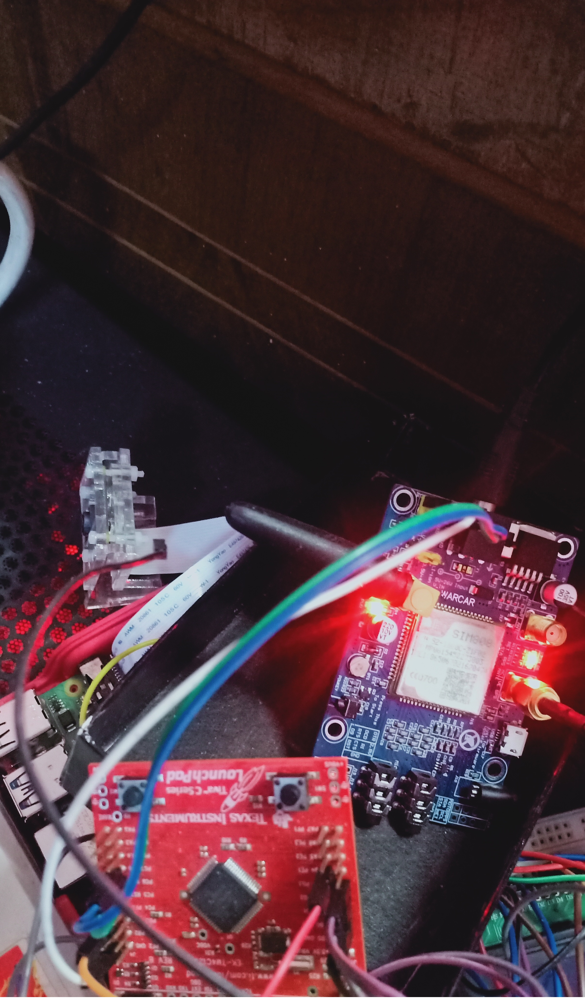
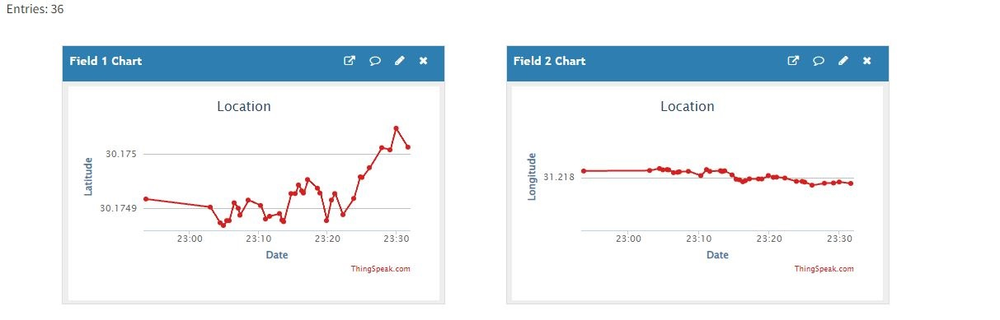
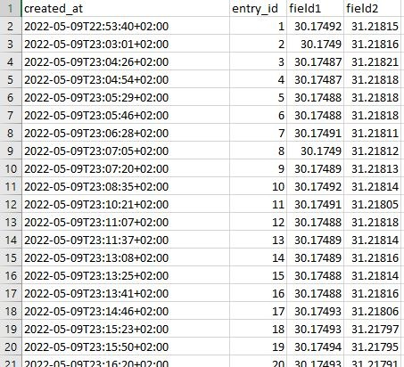

# Car Locator System

This system interfaces TM4C123G LaunchPad board with SIM808 GPS/GSM module to locate the car and upload its 
location to thingspeak server every specific time period. 

### TM4C123G LaunchPad
The TM4C123G LaunchPad Evaluation Kit is a low-cost evaluation platform for Arm Cortex-M4F based microcontrollers.

### SIM808 GPS/GSM module
SIM808 module is a GSM,GPRS and GPS three-in-one function module. It is based on the latest GSM/GPS module SIM808 from SIMCOM, supports GSM/GPRS Quad-Band network and combines GPS technology for satellite navigation.

### Connections

| TM4C | GPS/GSM |
|------|---------|
| Rx3  | Tx      |
| Tx3  | Rx      |
| GND  | GND     |

### System in real life 

### thingspeak data

also thingspeak give the ability to download the data in .csv form 

